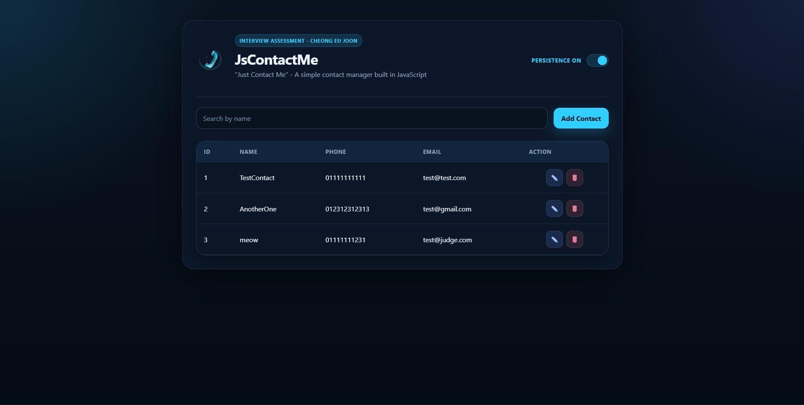

# JsContactMe

A lightweight contact management application built with plain JavaScript, HTML, and CSS.

The app is designed around a simple workflow: add contacts, search through them quickly, update existing entries, and remove records when no longer needed. The interface uses a modal-based form and a searchable table layout to keep the experience straightforward and easy to use.

## Live Repository

https://github.com/yuchiyun02/JsContactMe

## Preview



## Features

- Add a new contact with `name`, `phone`, and `email`
- View all saved contacts in a table
- Search contacts by name
- Edit an existing contact through the same modal form
- Delete a contact directly from the table
- Responsive UI for desktop and smaller screens

## Contact Model

Each contact contains:

- `id`
- `name`
- `phone`
- `email`

## Tech Stack

- HTML5
- CSS3
- Vanilla JavaScript

No frameworks or external libraries are used.

## Project Structure

```text
JsContactMe/
|-- assets/
|   `-- images/
|       `-- logo.png
|       `-- preview.png
|-- js/
|   |-- app.js
|   |-- contactService.js
|   `-- ui.js
|-- index.html
|-- style.css
`-- README.md
```

## Architecture

The codebase is split into small modules to keep responsibilities clear:

- `index.html`
  Provides the application layout, modal, and table structure.

- `js/app.js`
  Coordinates user actions such as add, edit, search, and delete.

- `js/contactService.js`
  Handles contact data operations and maintains the contact collection.

- `js/ui.js`
  Renders table rows, manages modal state, and reads or fills form inputs.

- `style.css`
  Defines the visual design, layout, responsive behavior, and theme styling.

## How It Works

1. Users open the modal to create a new contact.
2. Submitted data is added to the contact collection and rendered in the table.
3. The search input filters contacts by name in real time.
4. Each table row includes actions for editing and deleting a contact.
5. Editing reuses the modal with prefilled values for the selected record.

## Running The Project

Because the app uses JavaScript modules, it should be served through a local server or opened through a hosted project link rather than double-clicking `index.html`.

### Live Version

https://yuchiyun02.github.io/JsContactMe/

### Local Run

1. Clone or download the repository.
2. Serve the project with any simple local server.
3. Open the served URL in your browser.

Example options:

- VS Code Live Server
- `python -m http.server`
- any basic static file server

## Notes

- Data is managed on the client side.
- The application uses modular JavaScript for separation of concerns.
- The UI is intentionally compact and easy to present in a short walkthrough.

## Author

Cheong Eu Joon - 2026
